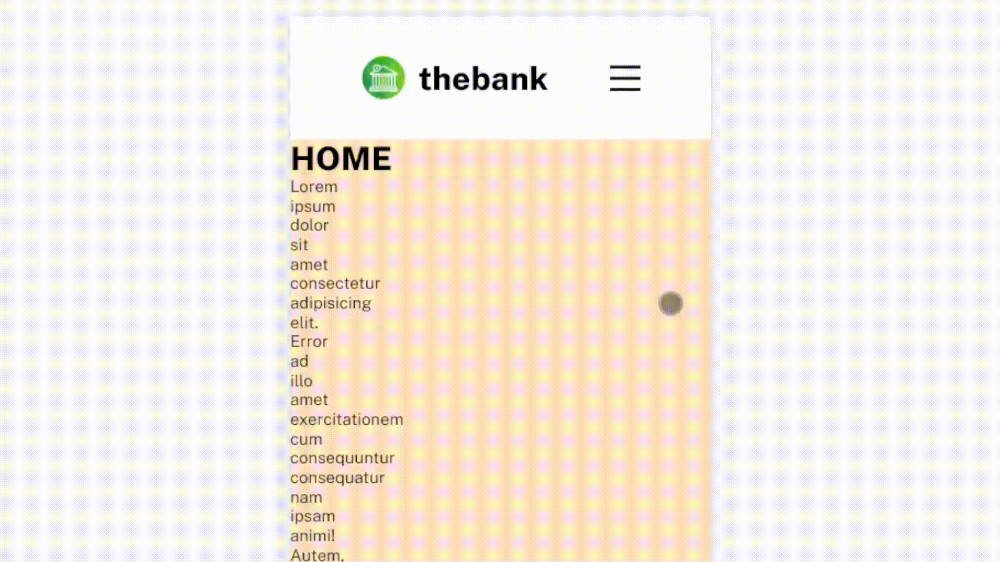
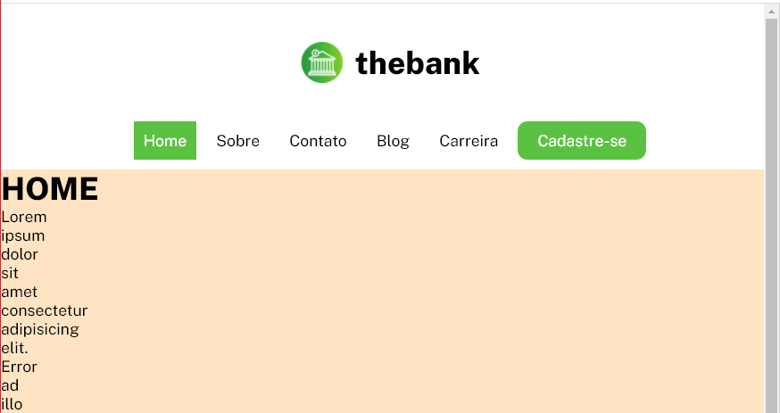
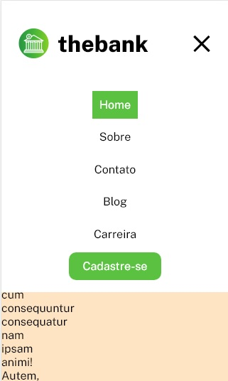
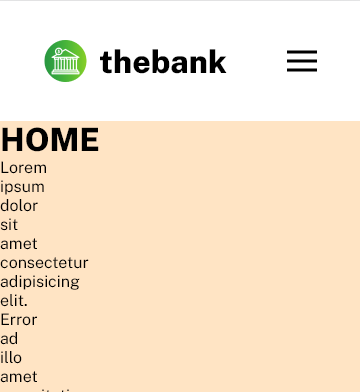

# Responsive animated navigation menu

Try at https://ddandev.github.io/Navigation-Menu/

To use:

1- Customize page links, titles and logo in `code/menu.html`.

2- Add the script to the end of each html page: ` `

3- All your page's content html must be inside `<main>`

4- Customize your CSS links and other html head tags you might want to add to every page in `code/headAppend.html`

___
## Hamburger and menu list animations!

### Desktop view

### Medium size view

### Mobile size view

   

